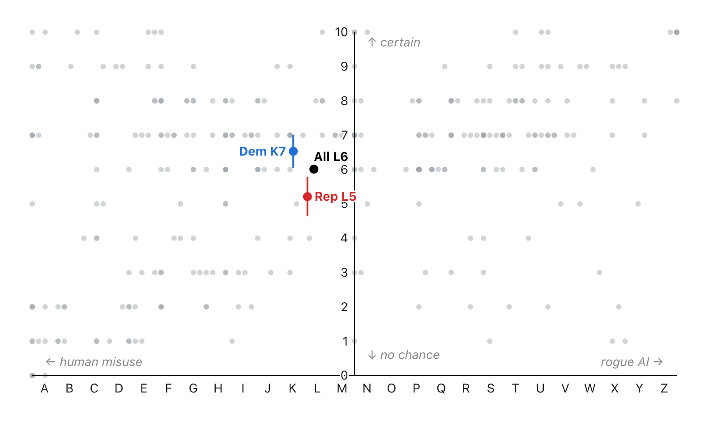

# upsi-300

This repo documents a small survey of Americans about AI risk: the survey instrument, the sample, and the data analysis. Further exploration and visualization lives in a companion [Observable notebook](https://observablehq.com/@colin8/upsi-300).

**Note**: Raw data exports are in `upsi-raws.zip.age`, encrypted with [age](https://github.com/FiloSottile/age). All the meaningful fields, at the individual participant level, are in `joined.tsv`. This is done to keep the participants' Prolific IDs blinded.

## UPSI survey

The survey is based on the [UPSI scale](https://aiimpactlab.substack.com/i/138455753/where-do-you-fall-on-the-upsi-x-risk-scale) concept: how worried someone is about AI catastrophe, and how much of that worry is about AI acting outside human control rather than humans misusing it. The full instrument, run in [Gorilla](https://gorilla.sc/):

> Some researchers and commentators have suggested that advanced artificial intelligence could one day cause severe, large-scale harm to humanity, whether through people deliberately misusing AI systems, or through AI systems acting in ways that their developers did not intend and cannot control. Others consider such outcomes unlikely or speculative.
>
> The following two questions ask about your own view.
>
> **Overall, how worried are you that AI could cause civilizational catastrophe?**
>
> *0 - there's no chance at all* <-slider-> *10 - it's certain at some point*
>
> **Of your total worry, how much comes from AI acting outside human control - rather than humans misusing AI?**
>
> *0% - all of it is human misuse* <-slider-> *100% - all of it is rogue AI*

## Prolific sample

Participants were recruited on [Prolific](https://www.prolific.com/), an opt-in online panel, using quotas on age, sex, ethnicity, and party ID, with a total recruitment target of 300. Because this is a small, quota-constructed, non-probability panel rather than a large, weighted, random sample, treat the results as suggestive, not nationally representative.

## Data analysis

The `mkfile` inner-joins the raw Prolific demographics export against the raw Gorilla questionnaire export (keyed on the Prolific `Submission id` == the Gorilla `Participant External Session ID`) into a tidy `joined.tsv`.

Briefly, we:

- keep only Prolific `APPROVED` / `AWAITING REVIEW` submissions with Gorilla `complete` questionnaire,
- bucket age into an `age_band`, and
- combine the control score's A–Z letter with the rounded catastrophe score into an `upsi_score` code (e.g. `N7`).

The join, filters, and quirks of each export are self-documented in the `mkfile`; `mk` regenerates `joined.tsv` from the two raw files.

Output columns:

- `submission_id`,
- `party_id`, `age`,
- `age_band`,
- `sex`,
- `ethnicity`,
- `ai_catastrophe_0_10`,
- `humans_robots_pct`,
- `upsi_score`.

Next, the `mkfile` rolls `joined.tsv` up into `stats.tsv`: one tidy row per subgroup (overall, then by sex, party, age band, and ethnicity), each with its count, the mean, standard error and standard deviation of both measures, and a `mean_upsi_score` code (the mean control score's letter + rounded mean catastrophe).

Output columns:

- `grp`,
- `n`,
- `mean_ai_catastrophe`, `se_ai_catastrophe`, `sd_ai_catastrophe`,
- `mean_humans_robots_pct`, `se_humans_robots_pct`, `sd_humans_robots_pct`,
- `mean_upsi_score`.

## Observable notebook

Exploration and charts live in an [Observable notebook](https://observablehq.com/@colin8/upsi-300).

