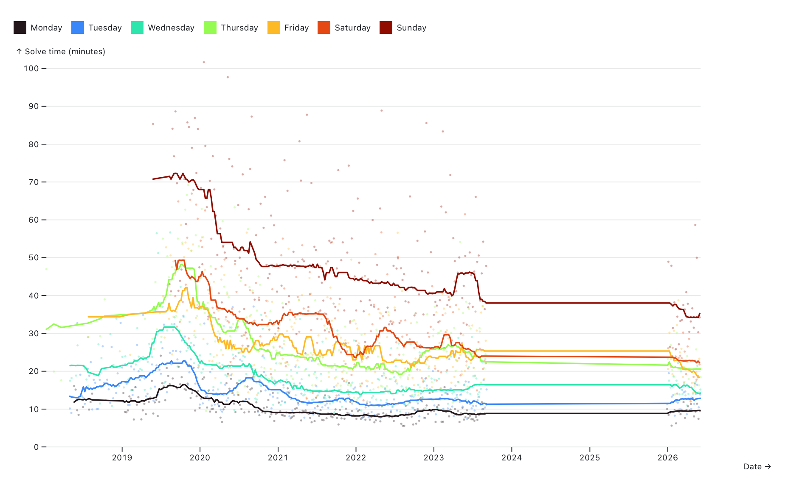
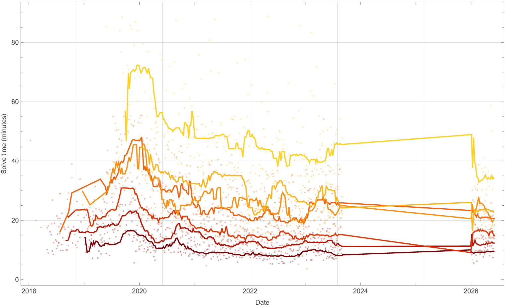

# xword-stats

This project has a few phases. 

**1/**

The first is using [mattdodge/nyt-crossword-stats](https://github.com/mattdodge/nyt-crossword-stats) to download a `data.csv` crossword data file from the NY Times. This is self-documented in the `mkfile`, but requires a valid `NYT-S` cookie from nytimes.com in a `.env` file.

**2/**

The second is using an Observable notebook [@colin8/xword-stats](https://observablehq.com/@colin8/xword-stats) to visualize `data.csv`, plotting solve times with a series for each weekday (difficulty) and a rolling median.

**3/**

The third is exploring notebook interfaces by reimplementing the Observable notebook in a Wolfram notebook (basically Mathematica).

Results checked in as [a file](colin-nyt-xword-stats.nb) and potentially available on the Wolfram Cloud [here](https://www.wolframcloud.com/obj/colin12/Published/colin-nyt-xword-stats.nb).

Wolfram Plot:

